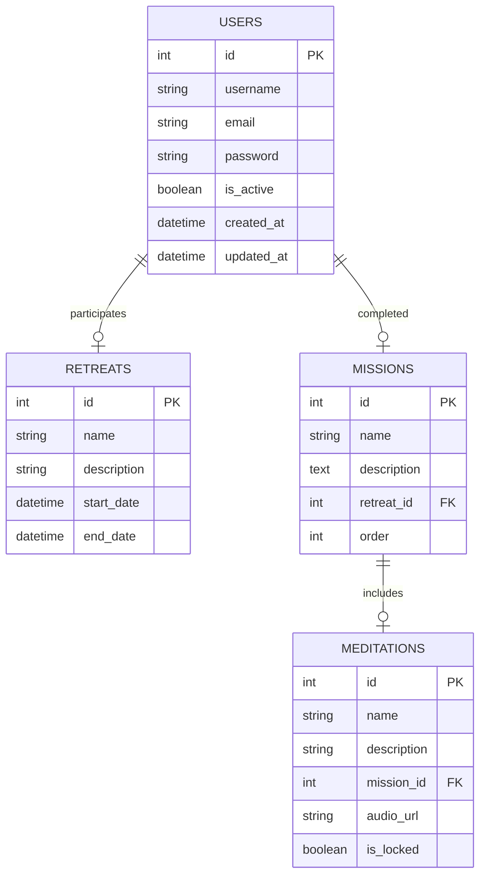
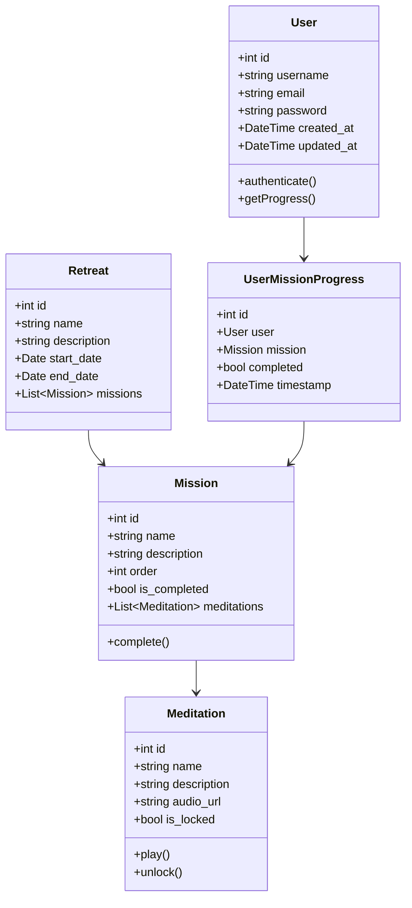
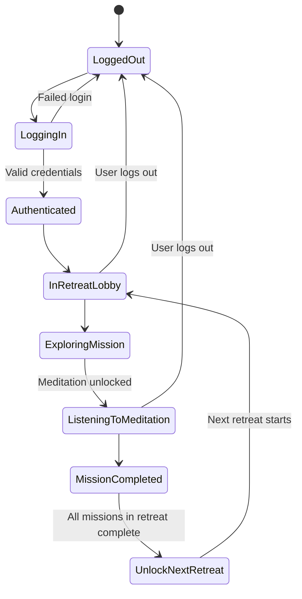
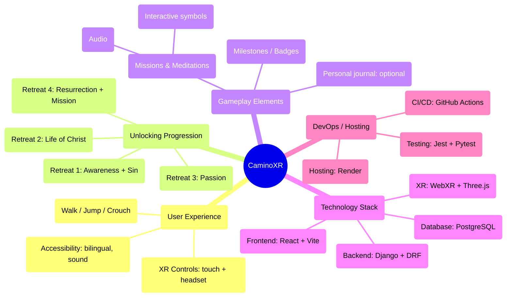
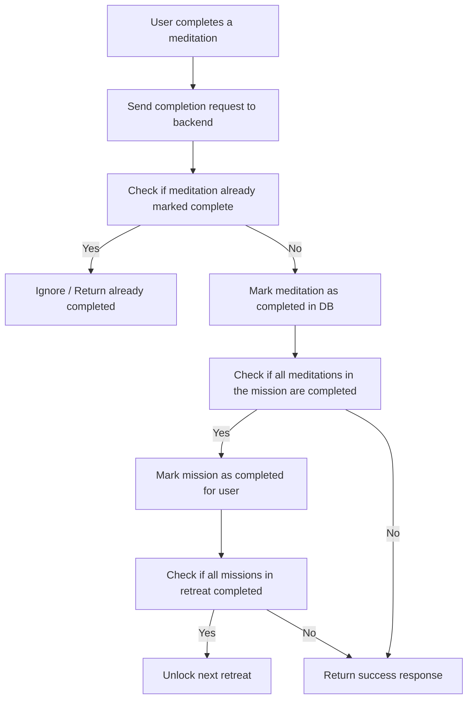
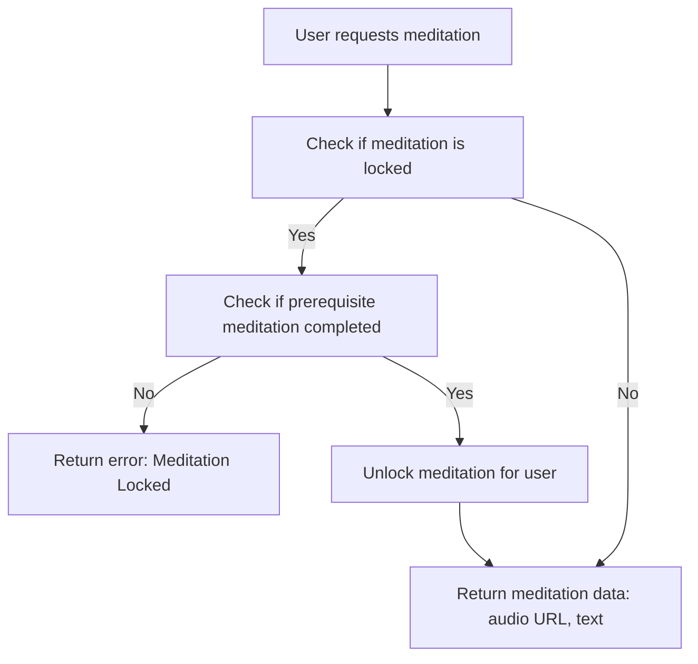
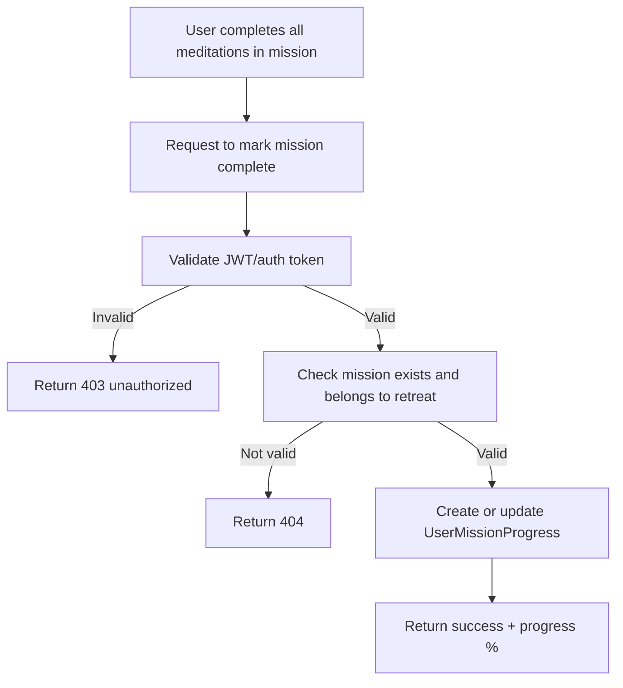

# Database Design

---

# Class Diagram

---

# State Diagram

### User Journey Through Retreats

---

# Mind Map

### Conceptual Breakdown

---

# Backend Logic

### 📊 **1. User Progress Tracking Flow**

---

### 🧩 **2. Unlock Meditation Logic**

---

### 🗂️ **3. Save Mission Completion State**

---
